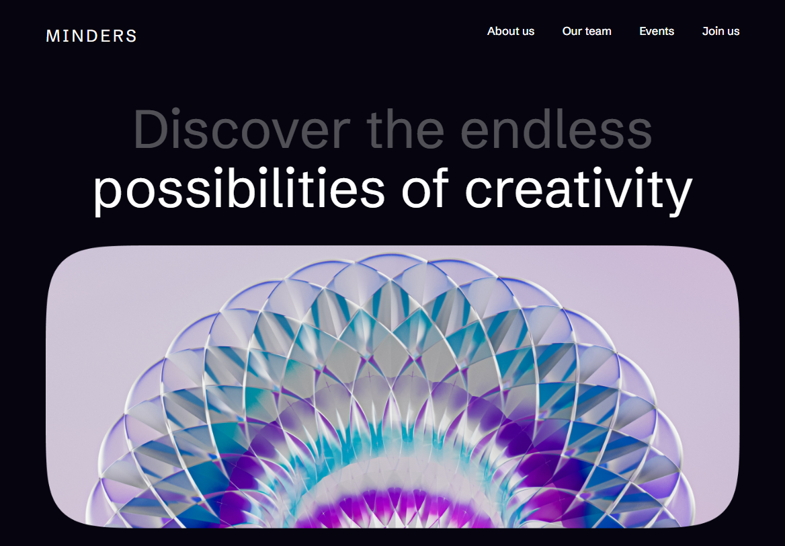
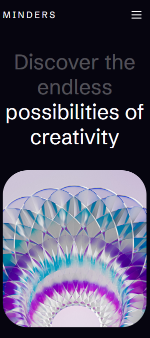
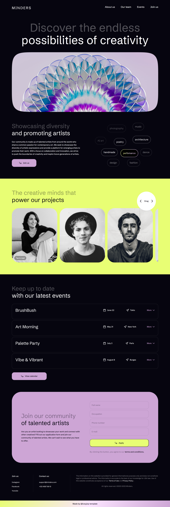

# 🎨 Trendy Minimalism — Responsive Landing Page

## 🔗 Live Demo
👉 [https://whalter26.github.io/TrendyMinimalism/]

---

## 🖼 Preview

### 🖥 Desktop

### 📱 Mobile

### Full page

---

Responsive landing page for a creative community platform featuring interactive UI elements, adaptive layouts and touch-friendly interactions.

The project was built independently to practice modern frontend development approaches, responsive design, component-based styling and user interaction patterns.

---

## ✨ Features

### 📱 Fully Responsive Layout

* Adaptive design for desktop, tablet and mobile devices
* Separate layout adjustments for smaller screens
* Responsive typography using `clamp()`

### 🎯 Interactive UI Elements

* Interactive cards with hover and touch interactions
* Touch-device support for mobile users
* Mobile navigation overlay
* Smooth scrolling navigation with anchor links

### 🧩 Component-Oriented CSS Architecture

* BEM methodology
* Reusable UI components
* CSS custom properties system
* Structured and reusable styles architecture

### ♿ Accessibility & UX Basics

* `:focus-visible` states
* `prefers-reduced-motion` support
* Adaptive interactions for coarse pointers
* Semantic HTML structure

### 🎨 Visual Details

* Glassmorphism-inspired UI elements
* Gradients and smooth transitions
* Responsive spacing and typography system
* Consistent SVG coloring using `currentColor`

---

## 🛠 Technologies

* HTML5
* CSS3
* JavaScript (Vanilla JS)
* SCSS
* Flexbox / CSS Grid
* BEM
* Responsive Design
* CSS Custom Properties

---

## 📌 What I Practiced in This Project

* Building responsive layouts from scratch
* Creating structured CSS architecture
* Developing reusable UI components
* Implementing touch-device interactions with JavaScript
* Improving UX with animations, hover/focus states and smooth scrolling
* Combining Grid and Flexbox depending on layout requirements

---

## 🚀 Project Status

Completed as a frontend practice and portfolio project.
